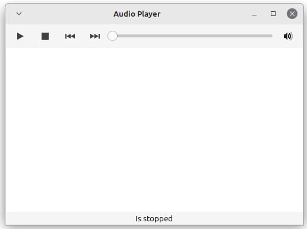

# Аудиоплеер

## Основные функции
* Поддержка форматов .mp3, .flac
* Воспроизведение
* Остановка
* Переход к предыдущему и следующему файлу
* Отображение названия текущего файла
* Отображение открытых библиотек

## Готово на данный момент
* Прототип окна аудиоплеера
  * Кнопка воспроизведения
  * Кнопка остановки
  * Кнопка перехода к предыдущему файлу
  * Кнопка перехода к следующему файлу
  * Слайдер для перемещения позиции проигрываемого аудиофайла
  * Кнопка громкости
  * Окно плейлиста
  * Статусбар
  
## TODO
* Реализация звукового движка
  * Открытие файлов
  * Воспроизведение и остановка файлов
  * Перемещение по позиции в аудиофайле
  * Изменение громкости воспроизводимого аудиофайла
* Реализация графического интерфейса
  * Привязка кнопок к соответствующим событиям
  * Изменение статусбара
  * Возможность добавления аудиофайлов
  * Возможность сохранения текущего плейлиста
  * Окно о программе
  * (опционально) отображение тегов из файла, обложки и текста (__при наличии__)

## Использованные библиотеки и языки
* Rust
* GTK4

## Скриншоты программы

